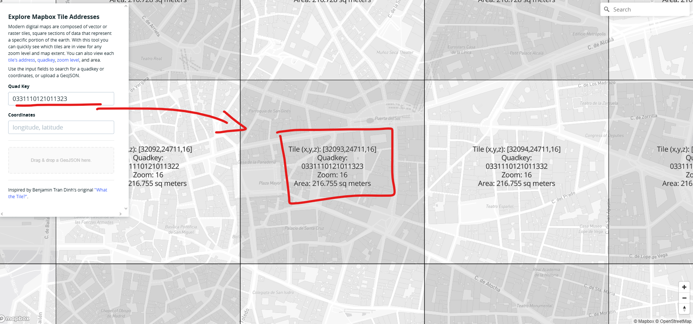

# Advanced Cybersecurity Solutions for 5G PBL - Using AI for Anomaly Detection and Response in 5G Networks

In this PBL we will learn how to use AI for anomaly detection and response. The PBL is divided in 4 steps:

1. Analyse a dataset containing simulated 5G service performance or logs.
2. Apply an AI model to detect anomalies.
3. Create visual or textual indicators of detected issues.
4. Propose a simplified incident response plan for city-level deployment.

This practical PBL exercise has an estimated duration of 140 minutes.

## Step 1: Analyse a dataset containing simulated 5G service performance or logs.

We will start by presenting the publicly available dataset to be used in the PBL and why it was chosen.

### Ookla Open Data – Mobile Network Performance

This dataset provides aggregated mobile network performance measurements, including 5G, collected from real user tests. This data is widely used in research and industry analysis and suitable for the study we're about to perform.

- Data is aggregated by geographic tiles
- Measurements are provided per time period (quarter)
- Metrics represent real service experience

---

### Key Performance Metrics in the Dataset

Each record represents a geographic tile and includes the following relevant fields:

- `avg_d_kbps` – Average download throughput (kilobits per second)
- `avg_u_kbps` – Average upload throughput (kilobits per second)
- `avg_lat_ms` – Average latency (milliseconds)
- `tests` – Number of speed tests performed
- `devices` – Number of unique devices
- `quadkey` – Tile identifier (spatial reference)
- `tile` – Tile geometry (WKT format)

---

### Data Acquisition

The dataset is distributed as Apache Parquet files via a public S3 bucket. You can download a sample Parquet with the [following link](https://ookla-open-data.s3.amazonaws.com/parquet/performance/type=mobile/year=2024/quarter=4/2024-10-01_performance_mobile_tiles.parquet). This sample file will also be present in the GitHub repository.

You can also find additional information regarding the files (as well as other download options) in the official [ookla open data github](https://github.com/teamookla/ookla-open-data?tab=readme-ov-file)


---

## Step 2: Apply an AI model to detect anomalies.

We will continue by making applying two AI models to detect possible anomalies in the dataset.

### Load + filter the data to a city area.
The Parquet contains tile geometry as Well Known Text (WKT). 

A practical approach is to use DuckDB to filter by a bounding box (e.g., Madrid) before modelling.

#### Install DuckDB Python dependencies
```shell
python -m venv .venv
source .venv/bin/activate
pip install duckdb pandas pyarrow shapely scikit-learn numpy
```

### Python: read Parquet files, filter to a Madrid bounding box
For this step you will need to run the ```dataFiltering.py``` to generate a filtered dataset.

After this is done we will explain how to use the Isolation Forest (IF) model to detect anomalies:

### Isolation Forest on single-quarter KPIs (city-only)
We will train an IsolationForest on the KPI feature space:
- ```avg_d_kbps```, ```avg_u_kbps```, ```avg_lat_ms```
- optionally ```tests```, ```devices``` (often useful as “confidence / volume” signals)

For this you will need to run the ```isolationForest.py``` file. This will load the file generated by the filtering and apply the IF model

## Step 3: Create textual indicators of detected issues.

We will continue by making a command-console compatible list of indicators to be used after generating the ```madrid_q3_2025_anomalies_ranked.csv``` file.

You will need to run the ```makeIndicators.py``` script:
```shell
python3 makeIndicators.py \
  --mode snapshot \
  --input madrid_q3_2025_anomalies_ranked.csv \
  --output madrid_q3_2025_indicators.csv
```

After this you can visualize the most severe indicators in the commands console by launching the ```visualize.py``` script.

This will show up the 15 most relevant anomalies (Note: you can edit the number of anomalies shown by editing the ```visualize.py``` script). You can visualize the locations by accessing an online quadkey visualizer like [What the Tiles](https://labs.mapbox.com/what-the-tile/) where you can paste a quadkey to see where it is (Note: You may have to remove Zoom by 1 unit to see the desired tile):



## Step 4: Propose a simplified incident response plan for city-level deployment.

Now we will analyse the data we've gathered and prepare a response plan consisting of 6 steps that will be explained below:


1. **Start – Visualized Indicators (from Step 3):** The process begins with textual indicators generated in Step 3.
2. **Decision 1 – Anomaly Reliability (Is action required?):** The operator assesses whether the detected anomaly is reliable and relevant enough to treat as an incident.
    - **If NO** – (e.g. the anomaly is LOW severity and has low confidence or could be a transient glitch) then continue monitoring the situation without escalation.
    - **If YES** – (the anomaly is significant – e.g. MEDIUM or higher severity, or a repeat/persistent degradation) then the anomaly is treated as a potential incident.
3. **Decision 2 – Impact Scope (How big is the problem?):** The operator evaluates the geographic scope of the anomaly’s impact. Regardless of the specific outcome, the flow continues to the next step (classification) with an understanding of scope in mind
4. **Decision 3 – Performance Classification (What kind of issue?):** The operator identifies which performance dimension is primarily affected by the anomaly, using the pattern of indicators.
    - If the classification is **“Low-confidence anomaly”** – it implies the data might be insufficient or too uncertain.
    - If the classification is **latency, throughput, or mixed** – the anomaly is confirmed as a real performance issue (affecting one or more service dimensions).
5. **Decision 4 – Severity-Based Response Selection (What should we do?):** The operator now decides how to respond based on severity.
    - **LOW severity** – Minor deviation or inconclusive issue. Action: ***Monitor***. Continue tracking the metrics. No direct intervention; the system remains under observation for any improvement or deterioration.
    - **MEDIUM severity** – Noticeable service impact, but not critical. Action: ***Investigate***. Hand over to the NOC or engineering team to do a deeper analysis. They might run diagnostics, review logs, and attempt to identify the root cause.
    - **HIGH severity** – Significant service degradation. Action: ***Escalate***. Notify management and possibly specialized teams (e.g. radio optimization, backhaul, core network teams). Increase the urgency: more frequent data collection, and pre-emptively allocate resources in case the situation degrades.
    - **CRITICAL severity** – Top-tier anomaly (e.g. affecting the top 1% of KPIs or a full outage). Action: Initiate Incident ***Response***. Launch a coordinated incident management procedure. This could include on-call engineers being dispatched, implementing traffic rerouting or fallback mechanisms, and sending out status alerts to city officials or the public if appropriate.
6. **Process – Post-Incident Review & Feedback:** After the incident is handled (or if the anomaly subsides), the operator conducts a post-incident review.
    - Were the alerts timely and accurate? Did any false alarms occur? For example, if many “LOW severity” anomalies triggered unnecessary investigations, the thresholds might be adjusted.
    - Based on the review, they refine the anomaly detection parameters (e.g. adjust what qualifies as HIGH severity, tweak the “low sample count” handling) to improve future detection. Lessons learned are incorporated into the monitoring system and the incident response plan.
